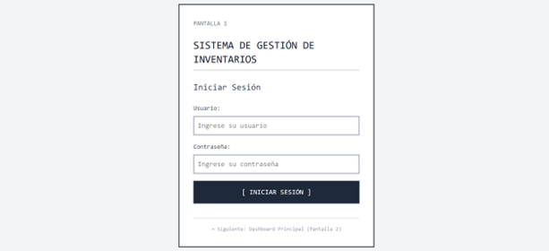
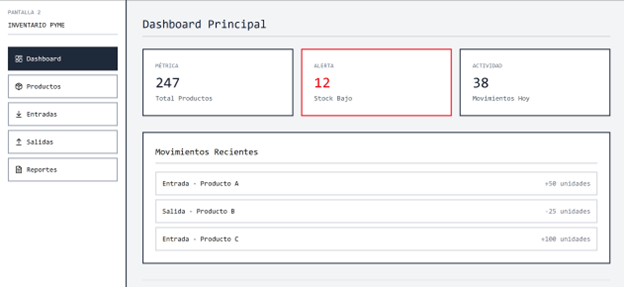
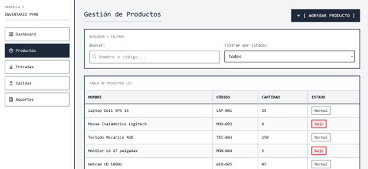
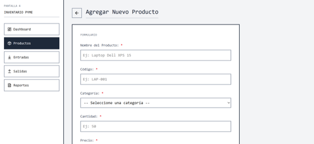
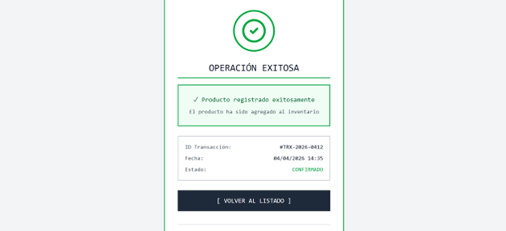

# Sistema de Gestión de Inventarios para PyMES

## 1. Descripción del Proyecto

Este proyecto consiste en el desarrollo de una aplicación web orientada a la gestión de inventarios en pequeñas y medianas empresas (PyMES). El sistema permitirá llevar un control eficiente de productos, entradas y salidas de inventario, así como la generación de reportes que apoyen la toma de decisiones.

La solución busca optimizar los procesos internos de las empresas, reducir errores en el manejo de inventario y mejorar la trazabilidad de los productos, proporcionando una herramienta tecnológica accesible y fácil de usar.

---

## 2. Objetivos

### Objetivo General

Desarrollar un sistema de gestión de inventarios para PyMES que permita mejorar el control, seguimiento y administración de productos, contribuyendo a una mejor toma de decisiones dentro de la organización.

### Objetivos Específicos

- Implementar un módulo para el registro, actualización y eliminación de productos.
- Desarrollar funcionalidades para el control de entradas y salidas de inventario.
- Generar reportes que permitan visualizar el estado actual del inventario.
- Diseñar un sistema de autenticación y gestión de usuarios con roles definidos.
- Garantizar la integridad y seguridad de la información almacenada.
- Facilitar una interfaz amigable que mejore la experiencia del usuario.

---

## 3. Tecnologías Utilizadas

El sistema será desarrollado utilizando tecnologías modernas orientadas al desarrollo web:

- **Frontend:** React.js  
- **Backend:** Node.js con Express  
- **Base de Datos:** PostgreSQL  
- **Control de Versiones:** Git y GitHub  
- **Contenedores:** Docker (para la base de datos)  
- **Validaciones:** Joi (para validación de datos)  
- **Autenticación:** JSON Web Tokens (JWT)  

Estas tecnologías permiten construir una aplicación escalable, segura y eficiente.

---

## Documentación Visual del Proyecto

### EDT

  

### Casos de Uso

  

## Documentación del Proyecto

### DERCAS
Documento de criterios de aceptación del sistema.

➡️ [Abrir DERCAS](IS/DERCAS.pdf)

---

### RF y RNF
Especificación de requerimientos funcionales y no funcionales.

➡️ [Abrir documento de Requerimientos](IS/RFyRNF.pdf)

### Mockups para sistema de inventario
Dejamos la interfaz de como ser la primera version del sistema, puedes visualizarlo en el siguiente enlance:

➡️ [Abrir Figma](https://www.figma.com/design/QjiQ0QQiPWJMy18bEVVvQx/IS-grupo-4-inventario-PyMES?t=Ub03n3hAhjYqwNM7-1)

### Infografia de metodologias utilizadas
Se deja con mas detalle cuales son las metodologias que utilizamos para realizar el proyecto.

➡️ [Abrir documento de Requerimientos](IS/MetodologiaUsadaIS.pdf)

---

## Visualizacion de sistema PyMES

### Mockups

  

  

  

  

  

